# Java基础

## 1. String 和StringBuffer和 StringBuilder的区别？

[String,StringBuffer与StringBuilder的区别??](https://blog.csdn.net/rmn190/article/details/1492013)

* String 字符串常量
* StringBuffer 字符串变量（线程安全）
* StringBuilder 字符串变量（非线程安全）

## 2. sleep() 区间wait()区间有什么区别？

> sleep 是Thread中的方法,线程暂停,让出CPU,但是不释放锁🔐 wait()是Object中的方法, 调用次方法必须让当前线程必须拥有此对象的monitor（即锁）,执行之后 线程阻塞,让出CPU, 同时也释放锁🔐; 等待期间不配拥有CPU执行权, 必须调用notify/notifyAll方法唤醒,(notify是随机唤醒)
唤醒并不意味着里面就会执行,而是还是需要等待分配到CPU才会执行；

## 3. Object 中有哪些方法？其中clone()，怎么实现一个对象的克隆,Java如何实现深度克隆？

> clone是浅拷贝;只克隆了自身对象和对象内实例变量的地址引用,使用它需要实现接口Cloneable; 使用ObjectStream进行深度克隆; 先将对象序列化；然后再反序列化;

```java 
public static <T extends Serializable> T deepClone(T t) throws CloneNotSupportedException {
        // 保存对象为字节数组
        try {
            ByteArrayOutputStream bout = new ByteArrayOutputStream();
            try(ObjectOutputStream out = new ObjectOutputStream(bout)) {
                out.writeObject(t);
            }
 
            // 从字节数组中读取克隆对象
            try(InputStream bin = new ByteArrayInputStream(bout.toByteArray())) {
                ObjectInputStream in = new ObjectInputStream(bin);
                return (T)(in.readObject());
            }
        }catch (IOException | ClassNotFoundException e){
            CloneNotSupportedException cloneNotSupportedException = new CloneNotSupportedException();
            e.initCause(cloneNotSupportedException);
            throw cloneNotSupportedException;
        }
    }
```

# ThreadLocal 相关

## 4. ThreadLocal作用和实现方式 ?

> TL用于保存本地线程的值, 每个Thread都有一个threadLocals属性,它是一个ThreadLocalMap对象,本质上是一个Entry数组;Entry是k-v结构; 并且是WeakReference弱引用, K存的是 Thread对象,Value是设置的值; 那么每个线程就可以读自己设置的值了;

ThreadLocal会不会发生内存泄漏?
> 会发生内存泄漏 ThreadLocalMap使用ThreadLocal的弱引用作为key，如果一个ThreadLocal没有外部强引用来引用它，那么系统 GC 的时候，这个ThreadLocal势必会被回收，这样一来，ThreadLocalMap中就会出现key为null的Entry，就没有办法访问这些key为null的Entry的value，如果当前线程再迟迟不结束的话，这些key为null的Entry的value就会一直存在一条强引用链：Thread Ref -> Thread -> ThreaLocalMap -> Entry -> value永远无法回收，造成内存泄漏。 其实，ThreadLocalMap的设计中已经考虑到这种情况，也加上了一些防护措施：在ThreadLocal的get(),set(),remove()的时候都会清除线程ThreadLocalMap里所有key为null的value。

1. 使用static的ThreadLocal，延长了ThreadLocal的生命周期，可能导致的内存泄漏
2. 分配使用了ThreadLocal又不再调用get(),set(),remove()方法，那么就会导致内存泄漏。

ThreadLocal为什么使用弱引用?

> key是弱引用好歹还可以 GC掉key的对象；强引用则不行 使用弱引用可以多一层保障：弱引用ThreadLocal不会内存泄漏，对应的value在下一次ThreadLocalMap调用set,get,remove的时候会被清除。

## 5. InheritableThreadLocal作用和实现方式 ？

> InheritableThreadLocal基础 ThreadLocal ; 他跟ThreadLocal区别是 可以传递值给子线程; 每个Thread都有一个inheritableThreadLocals属性, 创建子线程的时候,把把父线程的Entry数组 塞到子线程的Entry数组中; 所以就实现了父子线程的值传递; 注意如果Value是一个非基本类型的对象, 父子线程指向的是相同的引用; 子线程如果修改了值,父线程也是会修改的;

## 6. InheritableThreadLocal所带来的问题？

> 线程不安全: 如果说线程本地变量是只读变量不会受到影响，但是如果是可写的，那么任意子线程针对本地变量的修改都会影响到主线程的本地变量 线程池中可能失效: 在使用线程池的时候，ITL会完全失效，因为父线程的TLMap是通过Thread的init方法的时候进行赋值给子线程的，而线程池在执行异步任务时可能不再需要创建新的线程了，因此也就不会再传递父线程的TLMap给子线程了

## 7. 如何解决线程池异步值传递问题 (transmittable-thread-local)?

> 阿里开源的transmittable-thread-local可以很好的解决 在线程池情况下,父子线程值传递问题;TransmittableThreadLocal继承了InheritableThreadLocal, 简单的原理就是TTL 中的holder持有的是当前线程内的所有本地变量,被包装的run方法执行异步任务之前，会使用replay进行设置父线程里的本地变量给当前子线程，任务执行完毕，会调用restore恢复该子线程原生的本地变量

# HashMap ConcurrentHashMap相关

## 9. HashMap为什么线程不安全

> 1. 在JDK1.7中，当并发执行扩容操作时会造成环形链和数据丢失的情况。（链表的头插法 造成环形链）
> 2. 在JDK1.8中，在并发执行put操作时会发生数据覆盖的情况。（元素插入时使用的是尾插法） HashMap在put的时候，插入的元素超过了容量（由负载因子决定）的范围就会触发扩容操作，就是rehash，这个会重新将原数组的内容重新hash到新的扩容数组中，在多线程的环境下，存在同时其他的元素也在进行put操作，如果hash值相同，可能出现同时在同一数组下用链表表示，造成闭环，导致在get时会出现死循环，所以HashMap是线程不安全的。
     [JDK1.7和JDK1.8中HashMap为什么是线程不安全的](https://blog.csdn.net/swpu_ocean/article/details/88917958)

## 10. HashMap在jdk7和8中的区别

> JDK1.7用的是头插法，而JDK1.8及之后使用的都是尾插法，那么他们为什么要这样做呢？因为JDK1.7是用单链表进行的纵向延伸，当采用头插法就是能够提高插入的效率，但是也会容易出现逆序且环形链表死循环问题。但是在JDK1.
> 8之后是因为加入了红黑树使用尾插法，能够避免出现逆序且链表死循环的问题。 扩容后数据存储位置的计算方式也不一样：1. 在JDK1.7的时候是直接用hash值和需要扩容的二进制数进行&（这里就是为什么扩容的时候为啥一定必须是2的多少次幂的原因所在，因为如果只有2的n次幂的情况时最后一位二进制数才一定是1，这样能最大程度减少hash碰撞）（hash值 & length-1）
>
> [Hashmap的结构，1.7和1.8有哪些区别](https://blog.csdn.net/qq_36520235/article/details/82417949?utm_medium=distribute.pc_relevant.none-task-blog-BlogCommendFromBaidu-1.control&depth_1-utm_source=distribute.pc_relevant.none-task-blog-BlogCommendFromBaidu-1.control)

## 11. HashMap 为啥将链表改成红黑树？

> 提高检索时间,在链表长度大于8的时候，将后面的数据存在红黑树中，以加快检索速度。复杂度变成O(logn)

## 12. ConcurrentHashMap在jdk7和8中的区别?

> 可以看出JDK1.8版本的ConcurrentHashMap的数据结构已经接近HashMap，相对而言，ConcurrentHashMap只是增加了同步的操作来控制并发，从JDK1.7版本的ReentrantLock+Segment+HashEntry，到JDK1.8版本中synchronized+CAS+HashEntry+红黑树,相对而言

> 1. JDK1.8的实现降低锁的粒度，JDK1.7版本锁的粒度是基于Segment的，包含多个HashEntry，而JDK1.8锁的粒度就是HashEntry（首节点）
> 2. JDK1.8版本的数据结构变得更加简单，使得操作也更加清晰流畅，因为已经使用synchronized来进行同步，所以不需要分段锁的概念，也就不需要Segment这种数据结构了，由于粒度的降低，实现的复杂度也增加了
> 3. JDK1.8使用红黑树来优化链表，基于长度很长的链表的遍历是一个很漫长的过程，而红黑树的遍历效率是很快的，代替一定阈值的链表，这样形成一个最佳拍档
> 4. JDK1. 8为什么使用内置锁synchronized来代替重入锁ReentrantLock; 因为粒度降低了

提到synchronized时候,顺便说一下javaSE1.6对锁的优化？ 在JDK1.5中，synchronized是性能低效的。因为这是一个重量级操作，它对性能大的影响是阻塞的是实现，挂起
线程和恢复线程的操作都需要转入内核态中完成，这些操作给系统的并发性带来了很大的压力 javaSE1.6引入了偏向锁，轻量级锁（自旋锁）后，synchronized和ReentrantLock两者的性能就差不多了 锁可以升级, 但不能降级.
即: 无锁 -> 偏向锁 -> 轻量级锁 -> 重量级锁是单向的.

偏向锁
> 偏向锁: HotSpot的作者经过研究发现，大多数情况下，锁不仅不存在多线程竞争，而且总是由同一线程多次获得; 偏向锁是四种状态中最乐观的一种锁：从始至终只有一个线程请求某一把锁。 偏向锁的获取:
当一个线程访问同步块并成功获取到锁时，会在对象头和栈帧中的锁记录字段里存储锁偏向的线程ID，以后该线程在进入和退出同步块时不需要进行CAS操作来加锁和解锁，直接进入 偏性锁的撤销:
偏向锁使用了一种等待竞争出现才释放锁的机制，所以当其他线程竞争偏向锁时，持有偏向锁的线程才会释放偏向锁，并将锁膨胀为轻量级锁（持有偏向锁的线程依然存活的时候）

轻量级锁
> 多个线程在不同的时间段请求同一把锁，也就是说没有锁竞争。 加锁: 线程在执行同步块之前，JVM会先在当前线程的栈桢中创建用于存储锁记录的空间，并将对象头中的Mark Word复制到锁记录中，官方称为Displaced Mark Word。然后线程尝试使用CAS将对象头中的Mark Word替换为指向锁记录的指针。如果成功，当前线程获得锁，如果失败，表示其他线程竞争锁，当前线程便尝试使用自旋来获取锁。 解锁:轻量级锁解锁时, 会使用原子的CAS操作将当前线程的锁记录替换回到对象头, 如果成功, 表示没有竞争发生; 如果失败, 表示当前锁存在竞争, 锁就会膨胀成重量级锁.

重量级锁
> Java线程的阻塞以及唤醒，都是依靠操作系统来完成的,这些操作将涉及系统调用，需要从操作系统 的用户态切换至内核态，其开销非常之大。

其他优化
> 锁粗化:锁粗化就是将多次连接在一起的加锁、解锁操作合并为一次，将多个连续的锁扩展成为一个范围更大的锁 锁消除:锁消除即删除不必要的加锁操作。根据代码逃逸技术，如果判断到一段代码中，堆上的数据不会逃逸出当前线程， 那么可以认为这段代码是线程安全的，不必要加锁

## ReentrantLock和synchronized的区别？

> 在HotSpot虚拟机中, 对象在内存中的布局分为三块区域: 对象头, 示例数据和对其填充. 对象头中包含两部分: MarkWord 和 类型指针.
> 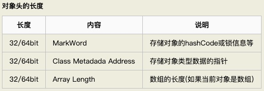
> 多线程下synchronized的加锁就是对同一个对象的对象头中的MarkWord中的变量进行CAS操作

Synchronized
> 对于Synchronized来说，它是java语言的关键字，是原生语法层面的互斥，需要jvm实现,Synchronized的使用比较方便简洁，并且由编译器去保证锁的加锁和释放
> 1. 代码块同步: 通过使用monitorenter和monitorexit指令实现的.
> 2. 同步方法: ACC_SYNCHRONIZED修饰

ReentrantLock
> ReenTrantLock的实现是一种自旋锁，通过循环调用CAS操作来实现加锁。它的性能比较好也是因为避免了使线程进入内核态的阻塞状态。
> 1. 等待可中断，持有锁的线程长期不释放的时候，正在等待的线程可以选择放弃等待，这相当于Synchronized来说可以避免出现死锁的情况。通过lock.lockInterruptibly()来实现这个机制。
> 2. 公平锁，多个线程等待同一个锁时，必须按照申请锁的时间顺序获得锁，Synchronized锁非公平锁，ReentrantLock默认的构造函数是创建的非公平锁，可以通过参数true设为公平锁，但公平锁表现的性能不是很好。
> 3. 锁绑定多个条件，一个ReentrantLock对象可以同时绑定对个对象。ReenTrantLock提供了一个Condition（条件）类，用来实现分组唤醒需要唤醒的线程们，而不是像synchronized 要么随机唤醒一个线程要么唤醒全部线程。

## 13. 为什么重写equals时候被要求重写hashCode（）？

> 如果两个对象相同（即：用 equals 比较返回true），那么它们的 hashCode 值一定要相同 如果两个对象的 hashCode 相同，它们并不一定相同（即：用 equals 比较返回 false 为了提供程序效率 通常会先进性hashcode的比较,如果不同,则就么有必要equals比较了;

## 14. 什么时候回发生内存泄露？让你写一段内存泄露的代码你会怎么写？

> [JAVA 内存泄露详解（原因、例子及解决）](https://blog.csdn.net/anxpp/article/details/51325838)
[Java中关于内存泄漏出现的原因以及如何避免内存泄漏](https://blog.csdn.net/wtt945482445/article/details/52483944?utm_source=blogxgwz8)
> 我们知道，对象都是有生命周期的，有的长，有的短，如果长生命周期的对象持有短生命周期的引用，就很可能会出现内存泄露

下面给出一个 Java 内存泄漏的典型例子，

```java
    Vector v=new Vector(10);
        for(int i=0;i< 100;i++){
        Object o=new Object();
        v.add(o);
        o=null;
        }
```

在这个例子中，我们循环申请Object对象，并将所申请的对象放入一个 Vector 中，如果我们仅仅释放引用本身，那么 Vector 仍然引用该对象，所以这个对象对 GC 来说是不可回收的。因此，如果对象加入到Vector 后，还必须从
Vector 中删除，最简单的方法就是将 Vector 对象设置为 null。 v = null

ThreadLocal使用不当也可能泄漏

# [Java内存模型](https://www.infoq.cn/article/java-memory-model-1/)

> 在共享内存的并发模型里，线程之间共享程序的公共状态，线程之间通过写 - 读内存中的公共状态来隐式进行通信。Java 的并发采用的是共享内存模型

线程之间的共享变量存储在主内存（main memory）中，每个线程都有一个私有的本地内存（local memory）
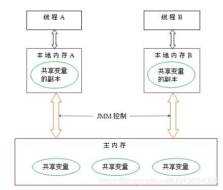

## 1. Java 内存模型中的 happen-before 是什么？

> 从 JDK5 开始，java 使用新的 JSR -133 内存模型,提出了 happens-before 的概念 如果一个操作执行的结果需要对另一个操作可见，那么这两个操作之间必须存在 happens-before 关系这里提到的两个操作既可以是在一个线程之内，也可以是在不同线程之间
> 1. 程序顺序规则：一个线程中的每个操作，happens- before 于该线程中的任意后续操作。
> 2. 监视器锁规则：对一个监视器锁的解锁，happens- before 于随后对这个监视器锁的加锁。
> 3. volatile 变量规则：对一个volatile 域的写，happens- before 于任意后续对这个volatile 域的读。
> 4. 传递性：如果 A happens- before B，且 B happens- before C，那么 A happens- before C。

注意，两个操作之间具有 happens-before 关系，并不意味着前一个操作必须要在后一个操作之前执行！

## 2. 简单聊聊volatile 的特性？以及内存语义

> 可见性。对一个 volatile 变量的读，总是能看到（任意线程）对这个 volatile 变量最后的写入。 原子性：对任意单个 volatile 变量的读 / 写具有原子性，但类似于volatile++ 这种复合操作不具有原子性。  
> volatile 写的内存语义：当写一个 volatile 变量时，JVM 会把该线程对应的本地内存中的共享变量刷新到主内存  
> volatile 读的内存语义: 当读一个 volatile 变量时，JVM 会把该线程对应的本地内存置为无效。线程接下来将从主内存中读取共享变量

为了实现 volatile 的内存语义，编译器在生成字节码时，会在指令序列中插入内存屏障来禁止特定类型的处理器重排序。 JVM 采取保守策略
> 在每个 volatile 写操作的前面插入一个 StoreStore 屏障。   
> 在每个 volatile 写操作的后面插入一个 StoreLoad 屏障。   
> 在每个 volatile 读操作的后面插入一个 LoadLoad 屏障。  
> 在每个 volatile 读操作的后面插入一个 LoadStore 屏障。

通过反编译可以看到，有volatile变量修饰的遍历，会有一个lock前缀的指令,lock前缀的指令在多核处理器下会引发了两件事情
> 将当前处理器缓存行的数据会写回到系统内存。   
> 这个写回内存的操作会引起在其他CPU里缓存了该内存地址的数据无效。

# GC垃圾回收

## 3.垃圾回收主要是针对 内存区的哪些区域？

> 主要追对的是 Java堆 和 方法区 ； java栈、程序计数器、本地方法栈都是线程私有的，线程生就生，线程灭就灭，栈中的栈帧随着方法的结束也会撤销，内存自然就跟着回收了。所以这几个区域的内存分配与回收是确定的，我们不需要管的。但是java堆和方法区则不一样，我们只有在程序运行期间才知道会创建哪些对象，所以这部分内存的分配和回收都是动态的。一般我们所说的垃圾回收也是针对的这一部分。

## 4.垃圾检查有哪些算法？

> 1. 引用计数法 ：给一个对象添加引用计数器，每当有个地方引用它，计数器就加1；引用失效就减1。 好了，问题来了，如果我有两个对象A和B，互相引用，除此之外，没有其他任何对象引用它们，实际上这两个对象已经无法访问，即是我们说的垃圾对象。但是互相引用，计数不为0，导致无法回收，所以还有另一种方法：
> 2. 可达性分析算法：以根集对象为起始点进行搜索，如果有对象不可达的话，即是垃圾对象。这里的根集一般包括java栈中引用的对象、方法区常良池中引用的对象

## 5.垃圾回收方法有哪些？

> 1. 标记-清除（Mark-sweep）:标记清除算法分为两个阶段，标记阶段和清除阶段。标记阶段任务是标记出所有需要回收的对象，清除阶段就是清除被标记对象的空间。优缺点：实现简单，容易产生内存碎片
> 2. 复制（Copying）将可用内存划分为大小相等的两块，每次只使用其中的一块。当进行垃圾回收的时候了，把其中存活对象全部复制到另外一块中，然后把已使用的内存空间一次清空掉。 优缺点：不容易产生内存碎片；可用内存空间少；存活对象多的话，效率低下。
> 3. 标记-整理（Mark-Compact）先标记存活对象，然后把存活对象向一边移动，然后清理掉端边界以外的内存 优缺点：不容易产生内存碎片；内存利用率高；存活对象多并且分散的时候，移动次数多，效率低下
> 4. 分代收集算法(目前大部分JVM的垃圾收集器所采用的算法）   
     年轻代（Young Generation）的回收算法 (回收主要以Copying为主)  
     年老代（Old Generation）的回收算法（回收主要以Mark-Compact为主）

## 什么时候会触发Full GC

> （1）调用System.gc时，系统建议执行Full GC，但是不必然执行  
> （2）老年代空间不足  
> （3）方法区(1.8之后改为元空间)空间不足  
> （4）创建大对象，比如数组，通过Minor GC后，进入老年代的平均大小大于老年代的可用内存  
> （5）由Eden区、From Space区向To Space区复制时，对象大小大于To Space可用内存，则把该对象转存到老年代，且老年代的可用内存小于该对象大小。

## GC机制简要说明一下，不同区使用的算法。

> 1. 年轻代：是所有新对象产生的地方。年轻代被分为3个部分——Enden区和两个Survivor区（From和to）当Eden区被对象填满时，就会执行Minor GC。并把所有存活下来的对象转移到其中一个survivor区（假设为from区）。Minor GC同样会检查存活下来的对象，并把它们转移到另一个survivor区（假设为to区）。这样在一段时间内，总会有一个空的survivor区。经过多次GC周期后，仍然存活下来的对象会被转移到年老代内存空间。通常这是在年轻代有资格提升到年老代前通过设定年龄阈值来完成的。需要注意，Survivor的两个区是对称的，没先后关系，from和to是相对的。
> 2. 年老代：在年轻代中经历了N次回收后仍然没有被清除的对象，就会被放到年老代中，可以说他们都是久经沙场而不亡的一代，都是生命周期较长的对象。对于年老代和永久代，就不能再采用像年轻代中那样搬移腾挪的回收算法，因为那些对于这些回收战场上的老兵来说是小儿科。通常会在老年代内存被占满时将会触发Full GC,回收整个堆内存。
>3. 持久代：用于存放静态文件，比如java类、方法等。持久代对垃圾回收没有显著的影响
    > 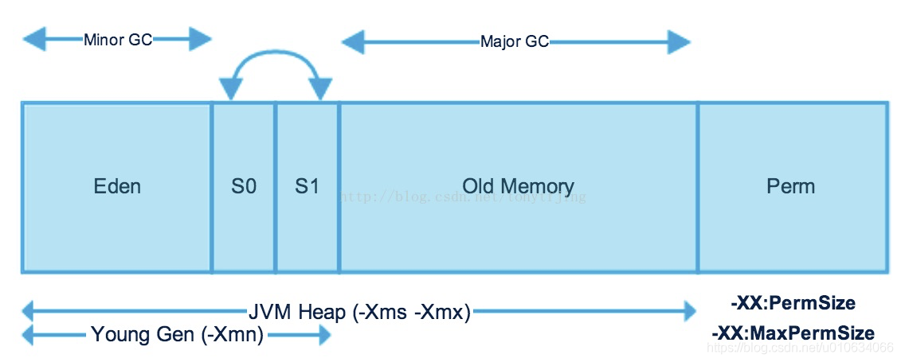

## 两个对象循环引用会不会被被GC？

> GC里边在JVM当中是使用的ROOT算法，ROOT算法 也就是根; 只要看这个两个对象有没有挂在 根 上, 挂在根上了 就不会被回收; 没有挂在根上就会回收;

## 哪些可以算作根节点？

> 1. 方法区中的静态属性
> 2. 方法区的中的常量
> 3. 虚拟机中的局部变量
> 4. 本地方法栈中JNI

## 垃圾收集器 G1有什么样的特性了解吗？ CMS呢？

[Cms与G1的优缺点](https://blog.csdn.net/zhou2s_101216/article/details/79219953)

CMS垃圾回收器：
> 1. 初始标记(CMS-initial-mark) ,会导致STW(stop-the-world)；
> 2. 并发标记(CMS-concurrent-mark)，与用户线程同时运行
> 3. 预清理（CMS-concurrent-preclean），与用户线程同时运行
> 4. 可被终止的预清理（CMS-concurrent-abortable-preclean） 与用户线程同时运行；
> 5. 重新标记(CMS-remark) ，会导致STW； 这个阶段会导致第二次stop the word，该阶段的任务是完成标记整个年老代的所有的存活对象。 这个阶段，重新标记的内存范围是整个堆，包含_young_gen和_old_gen。为什么要扫描新生代呢，因为对于老年代中的对象，如果被新生代中的对象引用，那么就会被视为存活对象，即使新生代的对象已经不可达了
> 6. 并发清除(CMS-concurrent-sweep)，与用户线程同时运行；

CMS垃圾回收器的优化
> 1.减少重新标记remark阶段停顿 一般CMS的GC耗时 80%都在remark阶段，如果发现remark阶段停顿时间很长，可以尝试添加该参数：-XX:+CMSScavengeBeforeRemark 在执行remark操作之前先做一次ygc，目的在于减少ygen对oldgen的无效引用，降低remark时的开销。

G1垃圾回收器

## CMS收集器和G1收集器的区别

> 区别一： 使用范围不一样 CMS收集器是老年代的收集器，可以配合新生代的Serial和ParNew收集器一起使用 G1收集器收集范围是老年代和新生代。不需要结合其他收集器使用   
> 区别二： STW的时间 CMS收集器以最小的停顿时间为目标的收集器。 G1收集器可预测垃圾回收的停顿时间（建立可预测的停顿时间模型）   
> 区别三： 垃圾碎片 CMS收集器是使用“标记-清除”算法进行的垃圾回收，容易产生内存碎片 G1收集器使用的是“标记-整理”算法，进行了空间整合，降低了内存空间碎片。

# Jvm相关

## Jvm内存结构简要说一些，栈里面一般存储了什么？

## Java内存模型简要描述一下?

## 类加载机制简要描述一下?

> 虚拟机把描述类的数据从Class文件加载到内存，并对数据进行校验、转换解析和初始化，最终形成可以被虚拟机直接使用的java类型。类加载和连接的过程都是在运行期间完成的。

类的加载方式
> 1）：本地编译好的class中直接加载   
> 2）：网络加载：java.net.URLClassLoader可以加载url指定的类   
> 3）：从jar、zip等等压缩文件加载类，自动解析jar文件找到class文件去加载util类  
> 4）：从java源代码文件动态编译成为class文件

类加载的过程
> 类加载的生命周期：加载（Loading）–>验证（Verification）–>准备（Preparation）–>解析（Resolution）–>初始化（Initialization）–>使用（Using）–>
卸载（Unloading）

加载
> a)加载阶段的工作  
> i.通过一个类的全限定名来获取定义此类的二进制字节流。   
> ii.将这个字节流所代表的静态存储结构转化为方法区的运行时数据结构。   
> iii.在java堆中生成一个代表这个类的java.lang. Class对象，做为方法区这些数据的访问入口。   
> b)加载阶段完成之后二进制字节流就按照虚拟机所需的格式存储在方区去中。

验证
> 这一阶段的目的是为了确保Class文件的字节流中包含的信息符合当前虚拟机的要求。

准备
> 准备阶段是正式为变量分配内存并设置初始值，这些内存都将在方法区中进行分配，这里的变量仅包括类标量不包括实例变量。

解析
> 解析是虚拟机将常量池的符号引用替换为直接引用的过程。

初始化
> 初始化阶段是执行类构造器()方法的过程

## JVM三种预定义类型类加载器

> a. Bootstrap ClassLoader/启动类加载器 主要负责jdk_home/lib目录下的核心 api 或 -Xbootclasspath 选项指定的jar包装入工作.  
> b. Extension ClassLoader/扩展类加载器 主要负责jdk_home/lib/ext目录下的jar包或 -Djava.ext.dirs 指定目录下的jar包装入工作  
> c. System ClassLoader/系统类加载器 主要负责java -classpath/-Djava.class.path所指的目录下的类与jar包装入工作.   
> d. User Custom ClassLoader/用户自定义类加载器(java.lang.ClassLoader的子类)
在程序运行期间, 通过java.lang.ClassLoader的子类动态加载class文件, 体现java动态实时类装入特性.

## 双亲委派加载

> JVM在加载类时默认采用的是双亲委派机制， 先往上 让上层加载器去加载
> 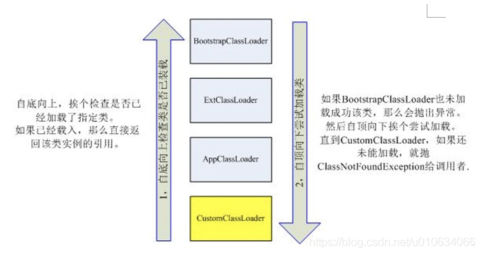

## 由不同的类加载器加载的指定类型还是相同的类型吗（不同）

> 在Java中，一个类用其完全匹配类名(fully qualified class name)
作为标识，这里指的完全匹配类名包括包名和类名。但在JVM中一个类用其全名和一个加载类ClassLoader的实例作为唯一标识，不同类加载器加载的类将被置于不同的命名空间. 所以是不相同的

## 在代码中直接调用Class.forName（String name）方法，到底会触发那个类加载器进行类加载行为？

> Class.forName(String name)默认会使用调用类的类加载器来进行类加载

## 在编写自定义类加载器时，如果没有设定父加载器，那么父加载器是?

> 在不指定父类加载器的情况下，默认采用系统类加载器(AppClassLoader);

## 编写自定义类加载器时，一般有哪些注意点？

> 一般尽量不要覆写已有的loadClass（…）方法中的委派逻辑; 这样做极有可能引起系统默认的类加载器不能正常工作

## 如何在运行时判断系统类加载器能加载哪些路径下的类？

> 一 是可以直接调用ClassLoader.getSystemClassLoader()或者其他方式获取到系统类加载器（系统类加载器和扩展类加载器本身都派生自URLClassLoader），调用URLClassLoader
> 中的getURLs() 方法可以获取到；   
> 二 是可以直接通过获取系统属性java.class.path 来查看当前类路径上的条目信息 ， System.getProperty("java.class.path")

## 在Java的反射中，Class.forName和ClassLoader的区别

> ClassLoader就是遵循双亲委派模型最终调用启动类加载器的类加载器 Class.forName()
方法实际上也是调用的CLassLoader来实现的;在这个forName0方法中的第二个参数被默认设置为了true，这个参数代表是否对加载的类进行初始化，设置为true时会类进行初始化，代表会执行类中的静态代码块，以及对静态变量的赋值等操作。 Class.forName 默认会进行初始化，执行静态代码块；有参数可以设置

# Java 类加载机制及常见异常

## ClassNotFoundException 发生在加载阶段

> 无法找到目标类 通常加载方式 Class.forName / ClassLoader.loadClass ; 导致原因：1、类名拼写错误或者没有拼写完整类名 2，没有导入相应的jar包

## ClassNotFoundError 发生在 链接 阶段

> 类加载过程有几个阶段 读取：找到.class文件，读取 链接：校验读取的class文件是否符合规范 初始化：载入静态资源 静态块 产生一个Class对象

## NoClassDefFoundError 通常在链接阶段

> Exception和Error的区别 首先Exception和Error都是继承于Throwable 类,在 Java 中只有 Throwable
> 类型的实例才可以被抛出（throw）或者捕获（catch），它是异常处理机制的基本组成类型。 Exception是java程序运行中可预料的异常情况，咱们可以获取到这种异常，并且对这种异常进行业务外的处理。   
> Error是java程序运行中不可预料的异常情况，这种异常发生以后，会直接导致JVM不可处理或者不可恢复的情况。所以这种异常不可能抓取到，比如OutOfMemoryError、NoClassDefFoundError等。

## 平时有没有遇到一些栈溢出或者内存溢出，内存泄露的问题吗？如何去分析这个问题？

> 内存泄漏是指对象实例在新建和使用完毕后，仍然被引用，没能被垃圾回收释放，一直积累，直到没有剩余内存可用。如果内存泄露，我们要找出泄露的对象是怎么被GC ROOT引用起来，然后通过引用链来具体分析泄露的原因。分析内存泄漏的工具有：Jprofiler，visualvm等。 内存溢出是指当我们新建一个实力对象时，实例对象所需占用的内存空间大于堆的可用空间。 栈（JVM Stack）存放主要是栈帧( 局部变量表, 操作数栈 , 动态链接 , 方法出口信息 )的地方。注意区分栈和栈帧：栈里包含栈帧。与线程栈相关的内存异常有两个： a）、StackOverflowError(方法调用层次太深，内存不够新建栈帧)
b）、OutOfMemoryError（线程太多，内存不够新建线程） 如果出现了内存溢出问题，这往往是程序本生需要的内存大于了我们给虚拟机配置的内存，这种情况下，我们可以采用调大-Xmx来解决这种问题

## 如果内存猛增，怎么去排查？

[通过jstack分析问题](http://www.ccblog.cn/84.htm)
> 1、利用top名称查看哪个java进程占用了较多的cpu资源；   
> 2、通过top -Hp pid可以查看该进程下各个线程的cpu使用情况；   
> 3.通过top -Hp命令定位到cpu占用率较高的线程tid之后，继续使用jstack pid命令查看当前java进程的堆栈状态 4.然后将刚刚找到的tid转换成16进制，在 jstack -pid里面的堆栈信息里面找到对应的线程信息

# 多线程

## 为什么《阿里巴巴Java开发手册》强制不允许使用Executor创建线程池

> 线程池不允许使用Executors去创建，而是通过ThreadPoolExecutor的方式，这样的处理方式让写的同学更加明确线程池的运行规则，规避资源耗尽的风险, 主要是Executor的一些方法创建的线程池的对了长度都非常大，容易堆积大量的请求,从而导致OOM

## ThreadPoolExecutor机制

> 下面是ThreadPoolExecutor最核心的构造方法参数：  
1）corePoolSize核心线程池的大小  
2）maximumPoolSize 最大线程池大小，当队列满了 就会创建新线程直至最大  
3）keepAliveTime 线程池中超过corePoolSize数目的空闲线程最大存活时间；可以allowCoreThreadTimeOut(true)使得核心线程超出有效时间也关闭  
4）TimeUnit keepAliveTime的时间单位  
5）workQueue阻塞任务队列  
6）threadFactory新建线程工厂,可以自定义工厂  
7）RejectedExecutionHandler当提交任务数超过maximumPoolSize+workQueue之和时，任务会交给RejectedExecutionHandler来处理

### 重点讲解

> corePoolSize，maximumPoolSize，workQueue三者之间的关系  
1）当线程池小于corePoolSize时，新提交的任务会创建一个新线程执行任务，即使线程池中仍有空闲线程。  
2）当线程池达到corePoolSize时，新提交的任务将被放在workQueue中，等待线程池中的任务执行完毕  
3）当workQueue满了，并且maximumPoolSize > corePoolSize时，新提交任务会创建新的线程执行任务  
4）当提交任务数超过maximumPoolSize，新任务就交给RejectedExecutionHandler来处理  
5）当线程池中超过 corePoolSize线程，空闲时间达到keepAliveTime时，关闭空闲线程  
6）当设置allowCoreThreadTimeOut(true)时，线程池中corePoolSize线程空闲时间达到keepAliveTime也将关闭

### RejectedExecutionHandler拒绝策略

> 1、AbortPolicy策略：该策略会直接抛出异常，阻止系统正常工作；  
2、CallerRunsPolicy策略：如果线程池的线程数量达到上限，该策略会把任务队列中的任务放在调用者线程当中运行；
> 3、DiscardOldestPolicy策略：该策略会丢弃任务队列中最老的一个任务，也就是当前任务队列中最先被添加进去的，马上要被执行的那个任务，并尝试再次提交；   
> 4、DiscardPolicy策略：该策略会默默丢弃无法处理的任务，不予任何处理。当然使用此策略，业务场景中需允许任务的丢失；

*也可以自己扩展RejectedExecutionHandler接口*

### workQueue任务队列

> 直接提交队列：设置为SynchronousQueue队列,提交的任务不会被保存，总是会马上提交执行  
有界的任务队列：有界的任务队列可以使用ArrayBlockingQueue实现  
无界的任务队列：有界任务队列可以使用LinkedBlockingQueue实现  
优先任务队列：优先任务队列通过PriorityBlockingQueue实现,它其实是一个特殊的无界队列,PriorityBlockingQueue队列可以自定义规则根据任务的优先级顺序先后执行

## 线程设置越多越好吗？设置到什么值比较合理？

### 如何设置线程数

> 那我们如何分配线程？我们提供一个公式： 最佳线程数目 = （（线程等待时间+线程CPU时间）/线程CPU时间 ）* CPU数目 备注：这个公式也是前辈们分享的，当然之前看了淘宝前台系统优化实践的文章，和上面的公式很类似，不过在CPU数目那边，他们更细化了，上面的公式只是参考。不过不管什么公式，最终还是在生产环境中运行后，再优化调整。 我们继续上面的任务，我们的服务器CPU核数为4核，一个任务线程cpu耗时为20ms，线程等待（网络IO、磁盘IO）耗时80ms，那最佳线程数目：( 80 + 20 )/20 * 4 = 20。也就是设置20个线程数最佳。 从这个公式上面我们就得出，线程的等待时间越大，线程数就要设置越大，这个正好符合我们上面的分析，可提升CPU利用率。那从另一个角度上面说，线程数设置多大，是根据我们自身的业务的，需要自己去压力测试，设置一个合理的数值。

### 基础常规标准

> 在确认了核心数后，再去判断是 CPU 密集型任务还是 IO 密集型任务： CPU 密集型任务： 比如像加解密，压缩、计算等一系列需要大量耗费 CPU 资源的任务，大部分场景下都是纯 CPU 计算。 IO 密集型任务： 比如像MySQL 数据库、文件的读写、网络通信等任务，这类任务不会特别消耗 CPU 资源，但是 IO 操作比较耗时，会占用比较多时间。
> 1. CPU密集型：操作内存处理的业务，一般线程数设置为：CPU核数 + 1 或者CPU核数*2。核数为4的话，一般设置 5 或 8
> 2. IO密集型：文件操作，网络操作，数据库操作，一般线程设置为：cpu核数 / (1-0.9)，核数为4的话，一般设置 40
     [原文链接](https://blog.csdn.net/fclwd/article/details/107032165)

## 锁

### CAS实现机制？

```java
内存中value的偏移量
        long valueOffset=Unsafe.getUnsafe().objectFieldOffset
        (AtomicInteger.class.getDeclaredField("value"));
public final boolean compareAndSet(int expect,int update){
        return unsafe.compareAndSwapInt(this,valueOffset,expect,update);
        }
```

> 通过本地方法Unsafe.getUnsafe().objectFieldOffset获取 值 在内存中的偏移量；然后又通过本地方法unsafe.compareAndSwapInt 去更新数据； 如果内存中的值跟期望中的值一样则 修改成update；

### CAS的ABA问题

> 如线程1从内存X中取出A，这时候另一个线程2也从内存X中取出A，并且线程2进行了一些操作将内存X中的值变成了B，然后线程2又将内存X中的数据变成A，这时候线程1进行CAS操作发现内存X中仍然是A，然后线程1操作成功。虽然线程1
> 的CAS操作成功，但是整个过程就是有问题的。比如链表的头在变化了两次后恢复了原值，但是不代表链表就没有变化 所以JAVA中提供了AtomicStampedReference/AtomicMarkableReference来处理会发生ABA问题的场景，主要是在对象中额外再增加一个标记来标识对象是否有过变更

# 算法

## 有哪些常用的排序算法？

> 冒泡算法、选择排序、插入排序、希尔排序、归并排序、快速排序

# Redis

## redis是单线程还是双线程？

> 大家所熟知的 Redis 确实是单线程模型，指的是执行 Redis 命令的核心模块是单线程的，而不是整个 Redis 实例就一个线程，Redis 其他模块还有各自模块的线程的。 Redis基于Reactor模式开发了网络事件处理器，这个处理器被称为文件事件处理器。它的组成结构为4部分：多个套接字、IO多路复用程序、文件事件分派器、事件处理器。 因为文件事件分派器队列的消费是单线程的`，所以Redis才叫单线程模型。
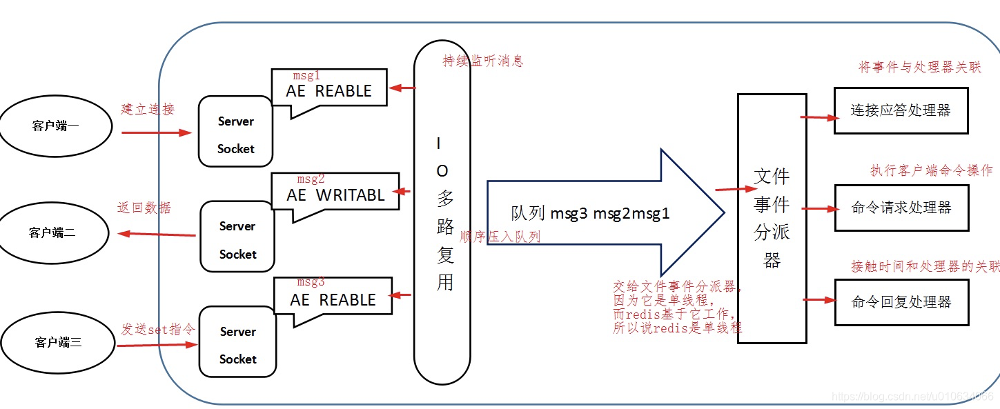

## Redis 不仅仅是单线程

> 一般来说 Redis 的瓶颈并不在 CPU，而在内存和网络。如果要使用 CPU 多核，可以搭建多个 Redis 实例来解决。 其实，Redis 4.0 开始就有多线程的概念了，比如 Redis 通过多线程方式在后台删除对象、以及通过 Redis 模块实现的阻塞命令等。

## Redis6.0为什么网络处理要引入多线程？

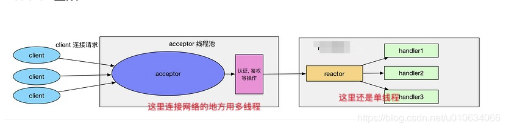
> 内存不够的话，可以加内存或者做数据结构优化和其他优化等 但网络的性能优化才是大头，网络 IO 的读写在 Redis 整个执行期间占用了大部分的 CPU 时间，如果把网络处理这部分做成多线程处理方式，那对整个 Redis 的性能会有很大的提升。Redis 的多线程部分只是用来处理网络数据的读写和协议解析，执行命令仍然是单线程

## 为什么redis的性能高？什么决定的？

> 1. 完全基于内存，绝大部分请求是纯粹的内存操作，非常快速。
> 2. 数据结构简单，对数据操作也简单，Redis 中的数据结构是专门进行设计的；
> 3. 采用单线程，避免了不必要的上下文切换和竞争条件，也不存在多进程或者多线程导致的切换而消耗CPU，不用去考虑各种锁的问题，不存在加锁释放锁操作，没有因为可能出现死锁而导致的性能消耗；(但是redis6.0已经开始使用多线程了，不过是在网络层面)
> 4. 使用多路 I/O 复用模型，非阻塞 IO；

## redis的持久化策略？

> Redis 提供两种持久化机制 RDB（默认） 和 AOF 机制:

## redis有哪些数据类型？

> 数据结构丰富，除了支持string类型的value外还支持hash、set、zset、list等数据结构。

## 你有尝试的去优化redis吗？ rdb和aof工作原理？各有什么优缺点

> RDB：是Redis DataBase缩写快照,RDB是Redis默认的持久化方式。按照一定的时间将内存的数据以快照的形式保存到硬盘中，对应产生的数据文件为dump.rdb。通过配置文件中的save参数来定义快照的周期。 优点：
> 1. 只有一个文件 dump.rdb，方便持久化。
> 2. 容灾性好，一个文件可以保存到安全的磁盘。
> 3. 性能最大化，fork 子进程来完成写操作，让主进程继续处理命令，所以是 IO 最大化。使用单独子进程来进行持久化，主进程不会进行任何 IO操作，保证了 redis 的高性能
> 4. 相对于数据集大时，比 AOF 的启动效率更高。   
     缺点:  
     数据安全性低。 RDB 是间隔一段时间进行持久化，如果持久化之间 redis 发生故障，会发生数据丢失。所以这种方式更适合数据要求不严谨的时候)

> AOF：持久化 是将Redis执行的每次写命令记录到单独的日志文件中，当重启Redis会重新将持久化的日志中文件恢复数据;当两种方式同时开启时，数据恢复Redis会优先选择AOF恢复。 优点:
> 1. 数据安全，aof 持久化可以配置 appendfsync 属性，有 always，每进行一次 命令操作就记录到 aof 文件中一次。
> 2. 通过 append 模式写文件，即使中途服务器宕机，可以通过 redis-check-aof工具解决数据一致性问题。
> 3. AOF 机制的 rewrite 模式。AOF 文件没被 rewrite 之前（文件过大时会对命令 进行合并重写），可以删除其中的某些命令（比如误操作的 flushall）)  
     缺点：   
     AOF 文件比 RDB 文件大，且恢复速度慢。 数据集大的时候，比 rdb 启动效率低。

## 如何选择合适的持久化方式

> 1. 如果需要达到很高的数据安全性，应该同时使用两种持久化功能。在这种情况下，当 Redis 重启的时候会优先载入AOF文件来恢复原始的数据，因为在通常情况下AOF文件保存的数据集要比RDB文件保存的数据集要完整。
> 2. 如果你非常关心你的数据， 但仍然可以承受数分钟以内的数据丢失，那么你可以只使用RDB持久化。
> 3. 有很多用户都只使用AOF持久化，但并不推荐这种方式，因为定时生成RDB快照（snapshot）非常便于进行数据库备份， 并且 RDB 恢复数据集的速度也要比AOF恢复的速度要快，除此之外，使用RDB还可以避免AOF程序的bug。

## Redis持久化数据和缓存怎么做扩容？

> 如果Redis被当做缓存使用，使用一致性哈希实现动态扩容缩容。  
> 如果Redis被当做一个持久化存储使用，必须使用固定的keys-to-nodes映射关系，节点的数量一旦确定不能变化。否则的话(
即Redis节点需要动态变化的情况），必须使用可以在运行时进行数据再平衡的一套系统，而当前只有Redis集群可以做到这样。

## Redis 对过期数据的处理

> 惰性删除:惰性删除不会去主动删除数据,而是在访问数据的时候，再检查当前键值是否过期，如果过期则执行删除并返回 null 给客户端，如果没有过期则返回正常信息给客户端。   
> 定期删除:
Redis会周期性的随机测试一批设置了过期时间的key并进行处理。测试到的已过期的key将被删除。

## LRU（the least recently used 最近最少使用）算法

> 如果一个数据在最近没有被访问到，那么在未来被访问的可能性也很小，因此当空间满的时候，最久没有被访问的数据最先被置换(淘汰)
LRU算法通常通过双向链表来实现，添加元素的时候，直接插入表头，访问元素的时候，先判断元素是否在链表中存在，如果存在就把该元素移动至表头 淘汰的时候 把队尾的一些删掉；

## Redis线程模型

> Redis基于Reactor模式开发了网络事件处理器，这个处理器被称为文件事件处理器（file event handler）。它的组成结构为4部分：多个套接字、IO多路复用程序、文件事件分派器、事件处理器。因为文件事件分派器队列的消费是单线程的，所以Redis才叫单线程模型

## 官方Redis Cluster 方案(服务端路由查询)

> Redis Cluster是一种服务端Sharding技术，3.0版本开始正式提供。Redis Cluster并没有使用一致性hash，而是采用slot(槽)
的概念，一共分成16384个槽。将请求发送到任意节点，接收到请求的节点会将查询请求发送到正确的节点上执行   
> 方案说明
> 1. 通过哈希的方式，将数据分片，每个节点均分存储一定哈希槽(哈希值)区间的数据，默认分配了16384 个槽位
> 2. 每份数据分片会存储在多个互为主从的多节点上
> 3. 数据写入先写主节点，再同步到从节点(支持配置为阻塞同步)
> 4. 同一分片多个节点间的数据不保持一致性
> 5. 读取数据时，当客户端操作的key没有分配在该节点上时，redis会返回转向指令，指向正确的节点
> 6. 扩容时时需要需要把旧节点的数据迁移一部分到新节点

*在 redis cluster 架构下，每个redis 要放开两个端口号，比如一个是 6379，另外一个就是 加1w 的端口号，比如 16379。 16379 端口号是用来进行节点间通信的，也就是 cluster
bus的东西，cluster bus 的通信，用来进行故障检测、配置更新、故障转移授权。cluster bus 用了另外一种二进制的协议，gossip 协议，用于节点间进行高效的数据交换，占用更少的网络带宽和处理时间。*

优点：
> 无中心架构，支持动态扩容，对业务透明   
> 具备Sentinel的监控和自动Failover(故障转移)能力   
> 客户端不需要连接集群所有节点，连接集群中任何一个可用节点即可   
> 高性能，客户端直连redis服务，免去了proxy代理的损耗

缺点：
> 运维也很复杂，数据迁移需要人工干预   
> 只能使用0号数据库   
> 不支持批量操作(pipeline管道操作)

## Redis的哨兵模式

> sentinel，中文名是哨兵。哨兵是 redis 集群机构中非常重要的一个组件，主要有以下功能：   
> 集群监控：负责监控 redis master 和 slave 进程是否正常工作。   
> 消息通知：如果某个 redis 实例有故障，那么哨兵负责发送消息作为报警通知给管理员   
> 故障转移：如果 master node 挂掉了，会自动转移到 slave node 上。   
> 配置中心：如果故障转移发生了，通知 client 客户端新的 master 地址。

哨兵用于实现 redis 集群的高可用，本身也是分布式的，作为一个哨兵集群去运行，互相协同工作。
> 故障转移时，判断一个 master node 是否宕机了，需要大部分的哨兵都同意才行，涉及到了分布式选举的问题。   
> 哨兵至少需要 3 个实例，来保证自己的健壮性。   
> 哨兵 + redis 主从的部署架构，是不保证数据零丢失的，只能保证redis 集群的高可用性。
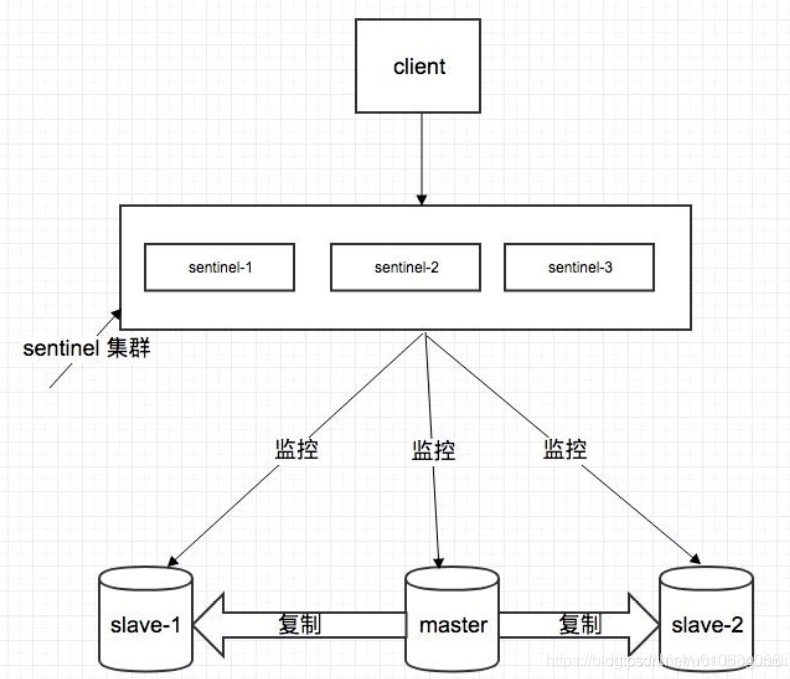

## 基于代理服务器分片

> 例如开源的： Twemproxy Codis  
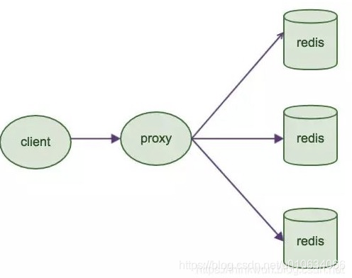

### redis的有哪些主从同步方式？

### redis集群扩容与收缩

### Redis底层ZSet跳表是如何设计与实现的

为什么 Redis 要用跳表来实现有序集合而不是红黑树？
> Redis 中的有序集合支持的核心操作主要有以下几个：   
> 插入一个数据   
> 删除一个数据   
> 查找一个数据   
> 按照区间查找数据   
> 迭代输出有序序列   
> 其中，插入、删除、查找以及迭代输出有序序列这几个操作，红黑树也可以完成，时间复杂度和跳表是一样的。 但是，按照区间查找数据这个操作，红黑树的效率没有跳表高。跳表可以在 O(logn)O(logn) 时间复杂度定位区间的起点，然后在原始链表中顺序向后查询就可以了，这样非常高效。 此外，相比于红黑树，跳表还具有代码更容易实现、可读性好、不容易出错、更加灵活等优点，因此 Redis 用跳表来实现有序集合。

### Redis底层ZSet实现压缩列表和跳表如何选择

### Redis高并发场景热点缓存如何重建

### 高并发场景缓存穿透&失效&雪崩如何解决

> 一、缓存穿透 缓存穿透是指查询一个根本不存在的数据，缓存层和持久层都不会命中。
> 解决方案：缓存空对象 布隆过滤器
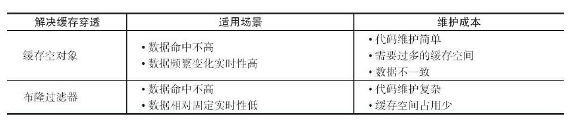

> 二、缓存雪崩 由于缓存层承载着大量请求，有效地保护了存储层，但是如果缓存层由于某些原因不可用（宕机）或者大量缓存由于超时时间相同在同一时间段失效（大批key失效/热点数据失效），大量请求直接到达存储层，存储层压力过大导致系统雪崩。  
解决方案：
> 1. 可以把缓存层设计成高可用的，即使个别节点、个别机器、甚至是机房宕掉，依然可以提供服务。利用sentinel或cluster实现。
> 2. 采用多级缓存，本地进程作为一级缓存，redis作为二级缓存，不同级别的缓存设置的超时时间不同，即使某级缓存过期了，也有其他级别缓存兜底
> 3. 缓存的过期时间用随机值，尽量让不同的key的过期时间不同（例如：定时任务新建大批量key，设置的过期时间相同）

> 三、缓存击穿  
系统中存在以下两个问题时需要引起注意：
> * 当前key是一个热点key（例如一个秒杀活动），并发量非常大。
> * 重建缓存不能在短时间完成，可能是一个复杂计算，例如复杂的SQL、多次IO、多个依赖等。   
    在缓存失效的瞬间，有大量线程来重建缓存，造成后端负载加大，甚至可能会让应用崩溃。  
    解决方案：
> 1. 分布式互斥锁 只允许一个线程重建缓存，其他线程等待重建缓存的线程执行完，重新从缓存获取数据即可。set(key,value,timeout)
> 2. 永不过期  
     从缓存层面来看，确实没有设置过期时间，所以不会出现热点key过期后产生的问题，也就是“物理”不过期。  
     从功能层面来看，为每个value设置一个逻辑过期时间，当发现超过逻辑过期时间后，会使用单独的线程去更新缓

### Redis集群架构如何抗住双十一的洪峰流量

### Redis缓存与数据库双写不一致如何解决

### Redis分布式锁主从架构锁失效问题如何解决

### 从CAP角度解释下Redis&Zookeeper锁架构异同

### 超大并发的分布式锁架构该如何设计

### 双十一亿级用户日活统计如何用Redis快速计算

### 双十一电商推荐系统如何用Redis实现

### 双十一电商购物车系统如何用Redis实现

### 类似微信的社交App朋友圈关注模型如何设计实现

### 美团单车如何基于Redis快速找到附近的车

### Redis 6.0 多线程模型比单线程优化在哪里了

# Spring

## 请简要描述一下IOC 和AOP？

### 依赖注入（Ioc）

> Spring 中的 IoC 的实现原理就是工厂模式加反射机制。  
IoC 的一些好处是：
> 1. 减少代码量。
> 2. 使应用程序易于测试，因为它不需要单元测试用例中的任何单例或 JNDI 查找机制。
> 3. 以最小的影响和最少的侵入机制促进松耦合。
> 4. 支持即时的实例化和延迟加载服务。

### AOP(Aspect-Oriented Programming), 即 面向切面编程

> 它与 OOP( Object-Oriented Programming, 面向对象编程) 相辅相成, 提供了与 OOP 不同的抽象软件结构的视角. 在 OOP 中, 我们以类(class)作为我们的基本单元, 而 AOP 中的基本单元是 Aspect(切面)

> AOP 术语
> > 通知（Advice）: AOP 框架中的增强处理。通知描述了切面何时执行以及如何执行增强处理。  
1 Before - 这些类型的 Advice 在 joinpoint 方法之前执行，并使用 @Before 注解标记进行配置。  
2 After Returning - 这些类型的 Advice 在连接点方法正常执行后执行，并使用@AfterReturning 注解标记进行配置。  
3 After Throwing - 这些类型的 Advice 仅在 joinpoint 方法通过抛出异常退出并使用 @AfterThrowing 注解标记配置时执行。    
4 After (finally) - 这些类型的 Advice 在连接点方法之后执行，无论方法退出是正常还是异常返回，并使用 @After 注解标记进行配置。  
5 Around - 这些类型的 Advice 在连接点之前和之后执行，并使用 @Around 注解标记进行配置。   
> 连接点（join point）: 连接点表示应用执行过程中能够插入切面的一个点，这个点可以是方法的调用、异常的抛出。在 Spring AOP 中，连接点总是方法的调用。   
> 切点（PointCut）: 可以插入增强处理的连接点。   
> 切面（Aspect）: 切面是通知和切点的结合。   
> 引入（Introduction）：引入允许我们向现有的类添加新的方法或者属性。   
> 织入（Weaving）: 将增强处理添加到目标对象中，并创建一个被增强的对象，这个过程就是织入。

#### AOP实现分类

> * 静态 AOP 实现， AOP 框架在编译阶段对程序源代码进行修改，生成了静态的 AOP 代理类（生成的 *.class 文件已经被改掉了，需要使用特定的编译器），比如 AspectJ。
> * 动态 AOP 实现， AOP 框架在运行阶段对动态生成代理对象（在内存中以 JDK 动态代理，或 CGlib 动态地生成 AOP 代理类），如 SpringAOP。

## Spring是怎么解决的循环依赖？

> Java中的循环依赖分两种，一种是构造器的循环依赖，另一种是属性的循环依赖。  
> 构造器的循环依赖就是在构造器中有属性循环依赖，如下所示的两个类就属于构造器循环依赖： 这种循环依赖没有什么解决办法，因为JVM虚拟机在对类进行实例化的时候，需先实例化构造器的参数，而由于循环引用这个参数无法提前实例化，故只能抛出错误。

## Spring 中使用的那种方式来实现动态代理的？

> 两种动态代理
> 1. java动态代理利用反射机制生成一个实现代理接口的匿名类，在调用具体方法前调用InvokeHandler来处理。
> 2. cglib动态代理利用asm开源包，对代理对象类的class文件加载进来，通过修改其字节码生成子类来处理。   
     spring中的动态代理 spring会自动在JDK动态代理和CGLIB之间转换  
     1、 默认使用Java动态代理来创建AOP代理，这样就可以为任何接口实例创建代理了。  
     2、 当需要代理的类没有实现代理接口的时候，Spring会切换为使用CGLIB代理。  
     3、 可以通过配置 强制使用CGLIB实现AOP ，配置方法为：
     (1)添加CGLIB库，SPRING_HOME/cglib/*.jar(2)在spring配置文件里面"proxy-target-class"属性设置为true 两种动态代理的区别1、实现方式(1)JDK动态代理只能对实现了接口的类生成代理，而不能针对类(2)CGLIB是针对类实现代理，主要是对指定的类生成一个子类，覆盖其中的方法因为是继承，所以该类或方法不要声明成final2、性能差别(1)使用CGLib实现动态代理，CGLib底层采用ASM字节码生成框架，使用字节码技术生成代理类， 比使用Java反射效率要高。唯一需要注意的是，CGLib不能对声明为final的方法进行代理，因为CGLib原理是动态生成被代理类的子类。(2)在对JDK动态代理与CGlib动态代理的代码实验中看，1W次执行下，JDK7及8的动态代理性能比CGlib要好20%左右。

## Spring中的事务传播机制？事务嵌套

> 事务的传播行为，默认值为 Propagation.REQUIRED。可选的值有：
> 1. PROPAGATION.REQUIRED：如果当前没有事务，则创建一个新事务。如果当前存在事务，就加入该事务。该设置是最常用的设置。
> 2. PROPAGATION.SUPPORTS：支持当前事务，如果当前存在事务，就加入该事务。如果当前不存在事务，就以非事务执行。
> 3. PROPAGATION.MANDATORY：支持当前事务，如果当前存在事务，就加入该事务，如果当前不存在事务，就抛出异常。
> 4. PROPAGATION.REQUIRE_NEW：创建新事务，无论当前存不存在事务，都创建新事务。
> 5. PROPAGATION.NOT_SUPPORTED：以非事务方式执行操作，如果当前事务存在，就把当前事务挂起。
> 6. PROPAGATION.NEVER：以非事务方式执行，如果当前存在事务，则抛出异常。
> 7. PROPAGATION.NESTED：如果当前存在事务，则在嵌套事务内执行。如果当前没有事务，则按 REQUIRED 属性执行。

## Spring中同一个类中有方法A 和 B 两个方法都被标记了@Transtional，在A中调用了B，那么B的事务会生效吗？为什么？

> * 不同类之间的方法调用，如类A的方法a()调用类B的方法b()，这种情况事务是正常起作用的。只要方法a()或b()配置了事务，运行中就会开启事务，产生代理。
> * 同一类内方法调用，无论被调用的b()方法是否配置了事务，此事务在被调用时都将不生效。

解决办法：
> 1. 放到不同的类中进行调用
> 2. 在spring配置文件中加入配置   
     <aop:aspectj-autoproxy/>
     <aop:aspectj-autoproxy proxy-target-class=“true” expose-proxy=“true” />
> 3. 将之前使用普通调用的方法,换成使用代理调用
     ((TestService)AopContext.currentProxy()).testTransactional2(); 获取到TestService的代理类，再调用事务方法，强行经过代理类，激活事务切面。
> 4. 使用异步操作，另外开启一个线程或者将这个消息写入到队列里面，在其他的地方进行处理

# BIO、NIO、AIO

## BIO

> Java BIO 就是传统的 Java IO 编程,同步并阻塞（传统阻塞型），服务器实现模式为一个连接一个线程，即客户端有连接请求时服务器端就需要启动一个线程进行处理，如果这个连接不作任何事情会造成不必要的线程开销。BIO 方式适用于连接数比较小且固定的架构
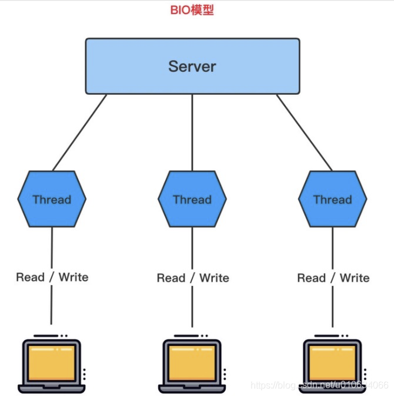

## NIO

> Java NIO 全称 Java non-blocking IO,NIO 同步非阻塞 有三大核心部分：Channel（管道）、Buffer（缓冲区）、Selector（选择器）。NIO 以块的方式处理数据，块 I/O 的效率比流 I/O 高很多 NIO 是面向缓冲区编程的。数据读取到了一个它稍微处理的缓冲区，需要时可在缓冲区中前后移动，这就增加了处理过程中的灵活性，使用它可以提供非阻塞的高伸缩性网络
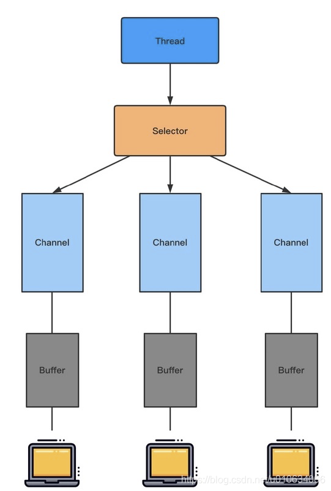

### Channel 的基本介绍

> * 1 通道是双向的可以进行读写，而流是单向的只能读，或者写。
> * 2 通道可以实现异步读写数据。
> * 3 通道可以从缓冲区读取数据，也可以写入数据到缓冲区。

## NIO 和 BIO 对比

> 1. BIO 以流的方式处理数据，而 NIO 以块的方式处理数据，块 I/O 的效率比流 I/O 高很多。
> 2. BIO 是阻塞的，而 NIO 是非阻塞的。
> 3. BIO 基于字节流和字符流进行操作，而 NIO 基于 Channel（通道）和 Buffer（缓冲区）进行操作，数据总是从通道读取到缓冲区中，或者从缓冲区写入到通道中。Selector（选择器）用于监听多个通道事件（比如连接请求，数据到达等），因此使用单个线程就可以监听多个客户端通道。 NIO比传统的BIO核心区别就是，NIO采用的是多路复用的IO模型，普通的IO用的是阻塞的IO模型

## AIO

> DK 7 引入了 Asynchronous I/O，即 AIO。在进行 I/O 编程中，通常用到两种模式：Reactor 和 Proactor 。Java 的 NIO 就是
> Reactor，当有事件触发时，服务器端得到通知，进行相应的处理。 AIO 叫做异步非阻塞的 I/O，引入了异步通道的概念，采用了 Proactor 模式，简化了程序编写，有效的请求才会启动线程，特点就是先由操作系统完成后才通知服务端程序启动线程去处理，一般用于连接数较多且连接时长较长的应用。

# TCP三次握手四次挥手

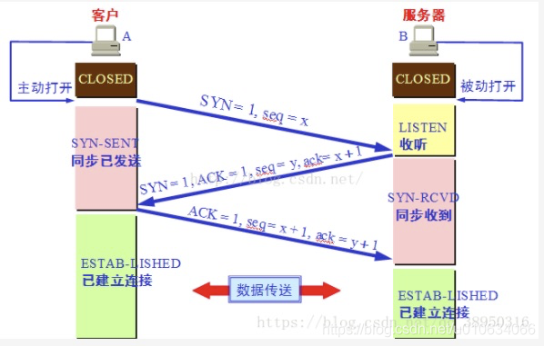
> 第一次握手  
> 建立连接时，客户端发送syn包（syn=j）到服务器，并进入SYN_SENT状态，等待服务器确认；SYN：同步序列编号（Synchronize Sequence Numbers）   
> 第二次握手  
> 服务器收到syn包，必须确认客户的SYN（ack=j+1），同时自己也发送一个SYN包（syn=k），即SYN+ACK包，此时服务器进入SYN_RECV状态；   
> 第三次握手  
> 客户端收到服务器的SYN+ACK包，向服务器发送确认包ACK(ack=k+1），此包发送完毕，客户端和服务器进入ESTABLISHED（TCP连接成功）状态，完成三次握手。

### 四次挥手

## 四次挥手中TIME_WAIT状态存在的目的是什么?

## TCP是通过什么机制保障可靠性的?

## TCP粘包，拆包及解决方法

> 产生粘包和拆包问题的主要原因是，操作系统在发送TCP数据的时候，底层会有一个缓冲区，例如1024个字节大小，如果一次请求发送的数据量比较小，没达到缓冲区大小，TCP
> 则会将多个请求合并为同一个请求进行发送，这就形成了粘包问题；如果一次请求发送的数据量比较大，超过了缓冲区大小，TCP就会将其拆分为多次发送，这就是拆包，也就是将一个大的包拆分为多个小包进行发送

> 1. 发送端给每个数据包添加包首部，首部中应该至少包含数据包的长度，这样接收端在接收到数据后，通过读取包首部的长度字段，便知道每一个数据包的实际长度了。
> 2. 发送端将每个数据包封装为固定长度（不够的可以通过补0填充），这样接收端每次从接收缓冲区中读取固定长度的数据就自然而然的把每个数据包拆分开来。
> 3. 可以在数据包之间设置边界，如添加特殊符号，这样，接收端通过这个边界就可以将不同的数据包拆分开。

# 分布式锁

## 数据库乐观锁

> 数据库更新某条记录为加锁状态, update 锁状态=加锁 from table where 锁状态=没加锁; 返回影响行数=0表示被别人加锁了就不能加了;

## Redis分布式锁

> 1. 互斥性。在任意时刻，只有一个客户端能持有锁。
> 2. 不会发生死锁。即使有一个客户端在持有锁的期间崩溃而没有主动解锁，也能保证后续其他客户端能加锁。
> 3. 具有容错性。只要大部分的Redis节点正常运行，客户端就可以加锁和解锁。
> 4. 解铃还须系铃人。加锁和解锁必须是同一个客户端，客户端自己不能把别人加的锁给解了。

### 加锁

> 主要回答 NX 意思是SET IF NOT EXIST，即当key不存在时，我们进行set操作；若key已经存在，则不做任何操作； 增加requestId，谁加的锁必须谁解锁 设置过期时间

```java
public static boolean tryGetDistributedLock(Jedis jedis,String lockKey,String requestId,int expireTime){

        String result=jedis.set(lockKey,requestId,SET_IF_NOT_EXIST,SET_WITH_EXPIRE_TIME,expireTime);

        if(LOCK_SUCCESS.equals(result)){
        return true;
        }
        return false;

        }

```

### 解锁

> 1.判断是不是自己加的锁 2.是的话删掉锁 3.使用lua实现上面两步骤 保持原子性！ 否则可能出现删除别人的锁的情况； 比如: A判断了是自己的锁,然后准备去删除这个锁，突然锁过期了,B这时候成功加锁了,那么A再执行删除操作的时候就会删掉B的锁

```public static boolean releaseDistributedLock(Jedis jedis, String lockKey, String requestId) {

        String script = "if redis.call('get', KEYS[1]) == ARGV[1] then return redis.call('del', KEYS[1]) else return 0 end";
        Object result = jedis.eval(script, Collections.singletonList(lockKey), Collections.singletonList(requestId));
 
        if (RELEASE_SUCCESS.equals(result)) {
            return true;
        }
        return false;
 
    }

```

# Mysql

## 本地事务

> * 原子性(Atomicity) 是通过 undo log 来实现的
> * 一致性(Consistency) 是通过 redo log 来实现的
> * 隔离型(Isolation) 是通过 (读写锁+MVCC)来实现的
> * 持久性(Durability)

## 隔离型(Isolation) 主要由MVCC和锁实现

> READ UNCOMMITED (未提交读)  
READ COMMITED (提交读)  
REPEATABLE READ (可重复读)  
SERIALIZABLE (可重复读)  
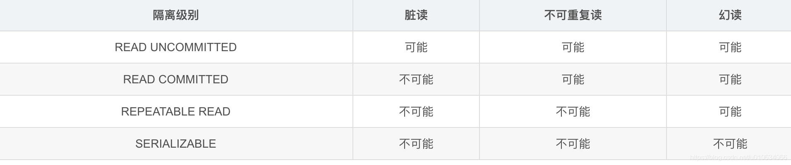
Mysql 默认隔离级别是REPEATABLE READ (可重复读); 但是他存在幻读的问题；也就是读取范围记录的时候,可能有其他事物插入了数据导致读取的不一致;

但是InnoDB解决了幻读问题; 通过MVCC 多版本并发控制解决了幻读问题; 具体是通过加锁,Next-Key Lock ：行锁和间隙锁组合起来就叫Next-Key Lock。

## MVCC 多版本并发控制

> InnoBD通过在每行的后面包车2个隐藏列实现,一个保存行的创建事件,一个是过期时间(或删除时间)，当然存储的并不是时机的时间,而是系统版本号; 每开一个新事务,系统版本号都会自增;

## 回滚日志 undo log

> 存在内存中的数据;用于记录数据被修改前的信息,为了在发生错误时回滚之前的操作，需要将之前的操作都记录下来，然后在发生错误时才可以回滚。

## 事务日志 REDO LOG Write Ahead Log（WAL）策略

> Write Ahead Log（WAL）策略 先写日志  
> mysql 为了提升性能不会把每次的修改都实时同步到磁盘，而是会先存到Boffer Pool(缓冲池)
> 里头，把这个当作缓存来用。然后使用后台线程去做缓冲池和磁盘之间的同步。
> ### 那么问题来了，如果还没来的同步的时候宕机或断电了怎么办？
> 所以引入了redo log来记录已成功提交事务的修改信息，并且会把redo
> log持久化到磁盘，系统重启之后在读取redo log恢复最新数据。
> ### 总结： redo log是用来恢复数据的 用于保障，已提交事务的持久化特性
> 既然 redo log也要刷盘 为什么不直接刷修改的数据到磁盘呢？ redo_log 存储的是顺序刷盘，而修改数据的刷盘是随机I/O； 前者更快
> r组提交 Group Commit，redo log 和 binlog 都具有组提交特性，在刷盘时通过等待一段时间来收集多个事务日志同时进行刷盘

## 锁

> 行锁（Record Lock）:锁直接加在索引记录上面，锁住的是key。  
> 间隙锁（Gap Lock）:锁定索引记录间隙，确保索引记录的间隙不变。间隙锁是针对事务隔离级别为可重复读或以上级别而已的。   
> Next-Key Lock：行锁和间隙锁组合起来就叫Next-Key Lock。

## 索引

### 索引类型

> * B+索引
> * 哈希索引
> * 空间数据索引
> * 全文索引

#### 哈希索引： 基于哈希表的实现

> 哈希索引只包含哈希值和行指针,不存储字段  
> 不是顺序存储,无法排序  
> 访问哈希索引的数据非常快  
> 哈希冲突多的话，一些索引维护操作代价也会很高  
> InnoDB有一个特殊功能叫 自适应哈希索引，当InnoDb注意到某些索引值被使用非常频繁，它会在内存中基于B-TREE索引之上在创建一个哈希索引; 完全是自动行为用户无法控制

## 高性能索引的一些策略

> 1.索引列不能是表达式的一部分,也不能是函数的参数 例如: 下面索引会失效,

```
select a from table where actor_id +1 = 5;
```

> 2.前缀索引.当字段里有很长字符串的列（TEXT,长的VARCHER等…）,在前几个字符串里加索引，这就是前缀索引。

```
alter table table_name add key(column_name(length));
```

## 什么是联合索引,为什么建议尽量用联合索引

> 为多列字段建立一个索引，称之为联合索引，联合索引需要遵从最左前缀原则  
多个单列索引在多条件查询时优化器会选择最优索引策略，可能只用一个索引，也可能将多个索引全用上！ 但多个单列索引底层会建立多个B+索引树，比较占用空间，也会浪费一定搜索效率，所以索引建议最好建联合索引

## 什么是覆盖索引，以及优点？

> 覆盖索引：  
> 一个辅助索引包含了查询结果的数据就叫做覆盖索引，即从辅助索引中就可以得到查询结果，而不需要从聚集索引中查询

## 为什么使用B+树,而不用其他的例如红黑树做索引

> 1. 文件很大，不可能全部存储在内存中，故要存储到磁盘上
> 2. 索引的结构组织要尽量减少查找过程中磁盘I/O的存取次数(为什么使用B-/+Tree，还跟磁盘存取原理有关。)
> 3. 局部性原理与磁盘预读，预读的长度一般为页(page)的整倍数，(在许多操作系统中，页得大小通常为4k)
> 4. 数据库系统巧妙利用了磁盘预读原理，将一个节点的大小设为等于一个页,默认16k，这样每个节点只需要一次I/O就可以完全载入，(由于节点中有两个数组，所以地址连续)。而红黑树这种结构，h明显要深的多。由于逻辑上很近的节点(父子)
     > 物理上可能很远，无法利用局部性

## InnoDB 与 MyISAM 存储引擎区别

### 区别：

> 1. InnoDB 支持事务，MyISAM 不支持事务。
> 2. InnoDB 支持外键，而 MyISAM 不支持。
> 3. InnoDB 是聚集索引，MyISAM 是非聚集索引。聚簇索引的文件存放在主键索引的叶子节点上，因此 InnoDB
     > 必须要有主键，通过主键索引效率很高。但是辅助索引需要两次查询，先查询到主键，然后再通过主键查询到数据。因此，主键不应该过大，因为主键太大，其他索引也都会很大。而 MyISAM 是非聚集索引，数据文件是分离的，索引保存的是数据文件的指针。主键索引和辅助索引是独立的。
> 4. InnoDB 不保存表的具体行数，执行 select count(*) from table 时需要全表扫描。而MyISAM 用一个变量保存了整个表的行数，执行上述语句时只需要读出该变量即可，速度很快；
> 5. InnoDB 最小的锁粒度是行锁，MyISAM 最小的锁粒度是表锁。一个更新语句会锁住整张表，导致其他查询和更新都会被阻塞，因此并发访问受限。这也是 MySQL 将默认存储引擎从 MyISAM 变成 InnoDB
     > 的重要原因之一。

### 如何选择：

> 1. 是否要支持事务，如果要请选择 InnoDB，如果不需要可以考虑 MyISAM；
> 2. 如果表中绝大多数都只是读查询，可以考虑 MyISAM，如果既有读写也挺频繁，请使用InnoDB。
> 3. 系统奔溃后，MyISAM恢复起来更困难，能否接受，不能接受就选 InnoDB；
> 4. MySQL5.5版本开始Innodb已经成为Mysql的默认引擎(之前是MyISAM)，说明其优势是有目共睹的。如果你不知道用什么存储引擎，那就用InnoDB，至少不会差。

分区分表分库 分区： 一张大表进行分区后，他还是一张表，不会变成二张表，但是他存放数据的区块变多了;突破磁盘I/O瓶颈，想提高磁盘的读写能力 分表: 多个表;单表的并发能力提高了，磁盘I/O性能也提高了
分区和分表的测重点不同，分表重点是存取数据时，如何提高mysql并发能力上；而分区呢，如何突破磁盘的读写能力，从而达到提高mysql性能的目的。 分库： 单机性能不够,分成多个库提升性能； 分表分库：
垂直切分，即将表按照功能模块、关系密切程度划分出来，部署到不同的库上水平切分，当一个表中的数据量过大时，我们可以把该表的数据按照某种规则

## 索引失效场景

> 1. 全值匹配不走索引,如id=1;
> 2. 索引字段使用 or 时，会导致索引失效而转向全表扫描;
> 3. 不要在索引上做任何操作（计算、函数、自动/手动类型转换），不然会导致索引失效而转向全表扫描;
> 4. mysql存储引擎不能继续使用索引中范围条件（between、<、>、in等）右边的列;
> 5. 尽量使用覆盖索引（只查询索引的列（索引列和查询列一致）），减少select *;
> 6. 索引字段上使用（！= 或者 < >）判断时，会导致索引失效而转向全表扫描;
> 7. 索引字段上使用 is null / is not null 判断时，会导致索引失效而转向全表扫描;
> 8. 索引字段使用like以通配符开头（‘%字符串’）时，会导致索引失效而转向全表扫描，使用覆盖索引可以解决(只查询索引的列（索引列和查询列一致）);
> 9. 索引字段是字符串，但查询时不加单引号，会导致索引失效而转向全表扫描;
> 10. 联合索引情况如下：
      > 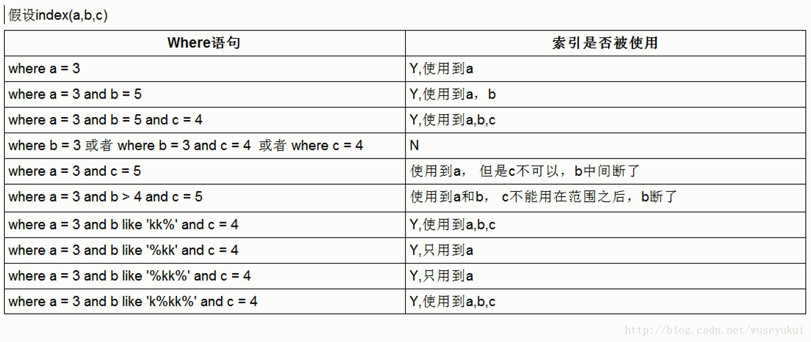